# How to Set Up SSO with SAML in Okta?

::: tip Coming Soon

This feature will begin rolling out in January 2023.

:::

This guide provides steps for setting up SAML for the Esper Console using the Okta identity provider. 

**To access SSO, you will need the following:**
- Enterprise Administrator access to the Esper console 
- Administrative access to Okta

**In this article:**
- Do I Need SAML SSO? 
- Creating a SAML Integration in Okta 
- Setting Up SAML in Esper 
- Granting Access to Users

## Do I Need SAML SSO? 

Not all organizations will need SAML SSO. Other methods, such as an email and password, are available in Esper. 

## Creating a SAML Integration in Okta 

**Step 1 Creating an Esper App in Okta**

Log in to an Okta account with administrative access. Go to the Applications tab, and select **‘Create App Integration’**. 

Choose **SAML 2.0**. 

In General Settings, name the application and optionally provide a logo. Then press “Next.” 

In Configure SAML, fill out the single sign-on URL and Audience URI. 

Use a temporary URL such as https://esper.cloud. You will need to change this to the actual URL later. 

In Audience URI, type in a temporary name such as ‘Esper’. You will change it later.

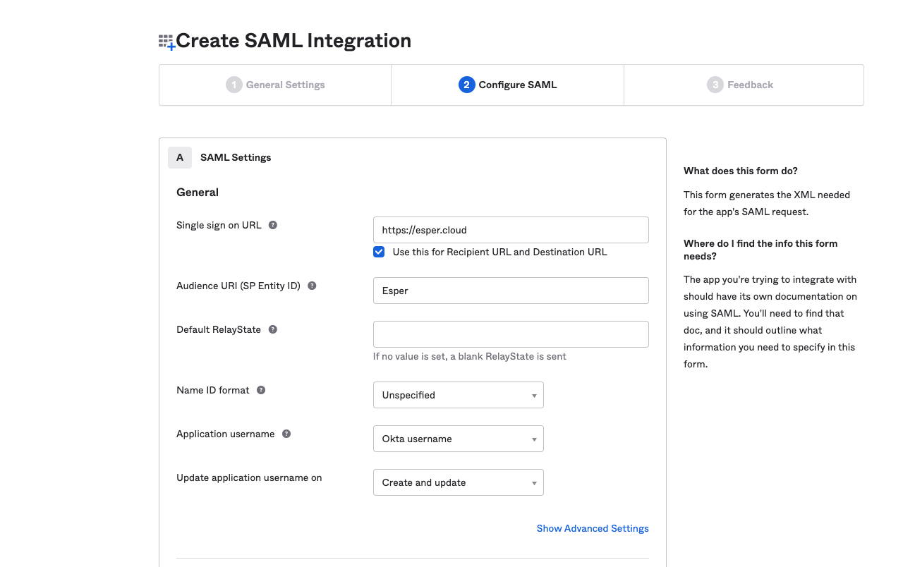

Press **Next.** You may need to fill out Okta’s feedback form. Then press **Finish.**

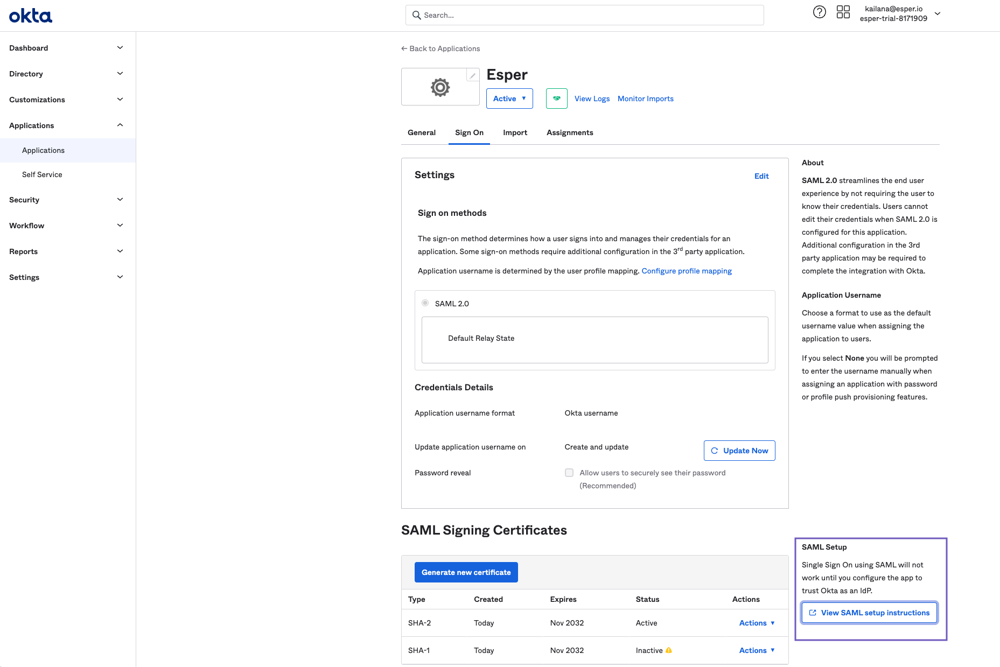

You’ll be redirected to the Esper SAML application page. 

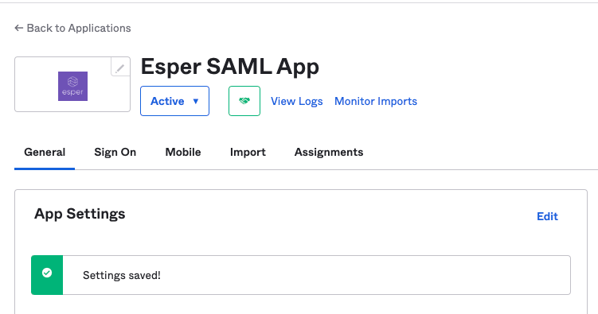

From the Sign-on tab, click on **View SAML setup instructions**. You may need to scroll down or use the finder to locate View SAML setup instructions. 

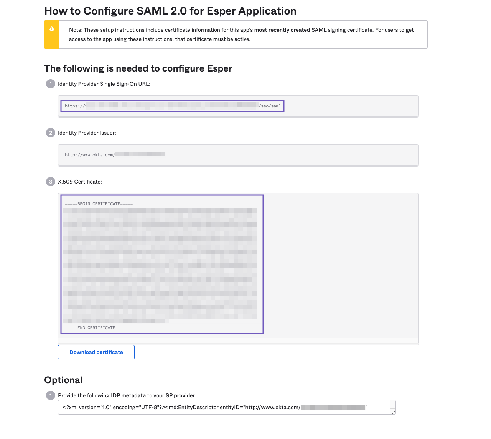

Copy the **Identity Provider Sign-On URL** and **X.509 certificate’** in their entirety. Save this information in a secure document. You will need to paste this information to the Esper tenant (see Step 3). 

Leave the Okta window open, create a new tab or window, and navigate to your Esper tenant. 

### Setting Up SAML in Esper 

**Step 2 Adding a New Connection**

In your Esper tenant,  add a SAML SSO by clicking on your user drop-down and selecting Single Sign-on (SSO). 

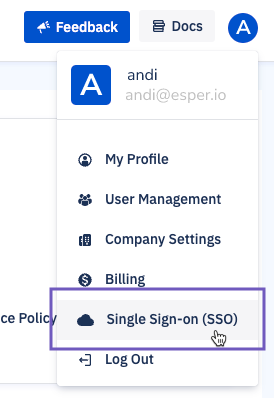

Then select  **‘+Add New Connection’**. 

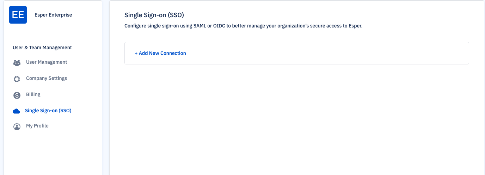

Choose SAML as the SSO configuration. 

Use the identity provider as the “Connection Name.” The Configuration Name will be the name users see as an option before logging in.

**Step 3 Providing Okta Details to Esper**

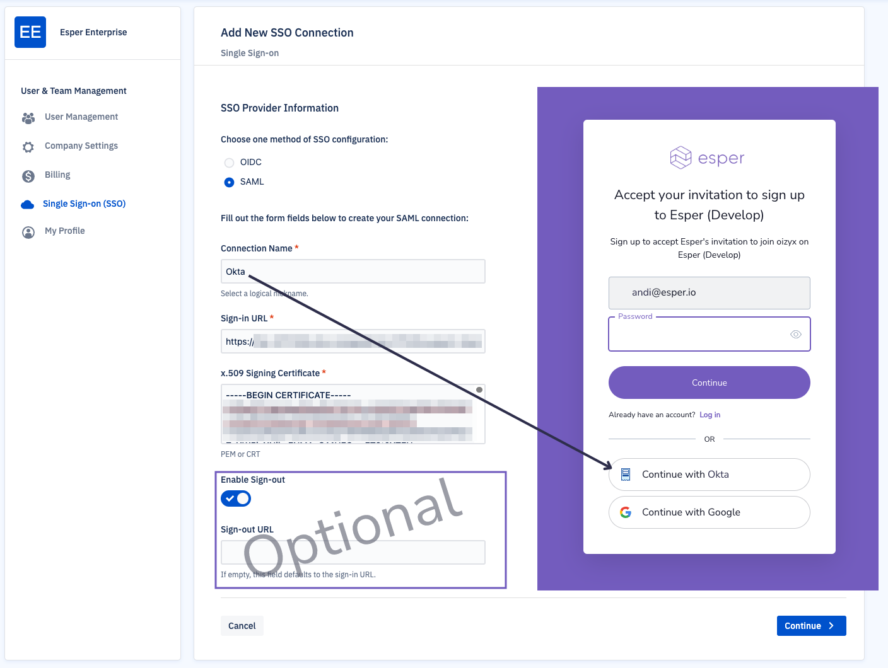

In Esper’s “Add New SSO Connection”, input the following information copied from Step 1: 
- Identity provider Single Sign-On URL 
- X.509 Certificate 
- Optional: Sign-out URL

:::tip 
Should you provide a sign-out URL? Most organizations will not need a sign-out URL, also known as a single logout (SLO). Use SLO only if you want to log out the user from Okta when they sign out of Esper. 
:::

### Setting Up Single Sign-out (Optional)

::: details

Ensure that the Enable Sign-out option is set to active. 

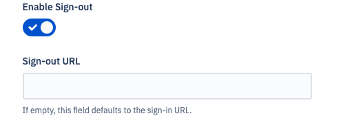

Optionally include a sign-out URL (this is usually the Okta login page URL). 

::: 

Then press **Continue.** 

**Step 4 Finalize SSO Configuration in Okta**

You’ve set up SSO on the Esper end, but you still need to provide Okta your Esper tenant’s ACS URL and Entity ID. 

On Esper’s “Complete Configuration” page, copy the ACS URL and Entity ID to a secure document. 

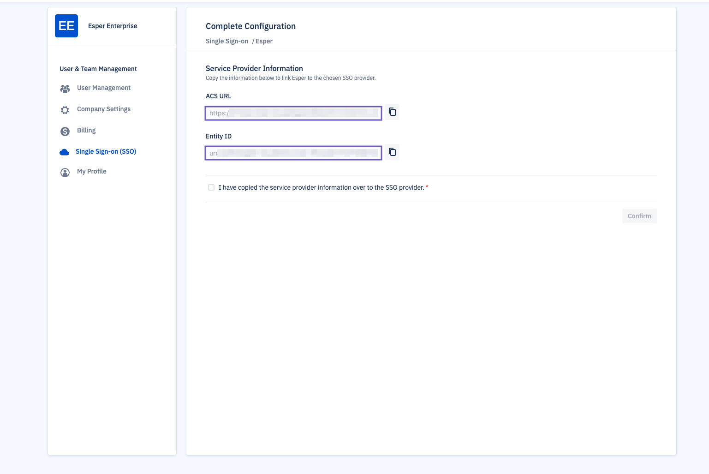

### Copying the Logout URL (Optional)

::: details

If you plan to set up SLO, copy the Logout URL to a secure document and download the certificate. 

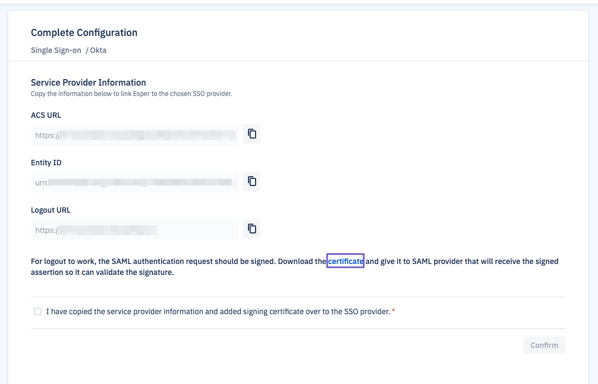

:::

Then, go to your Okta application page. Go to “General” > “SAML Settings” and click **Edit.** Then click **Next**. 

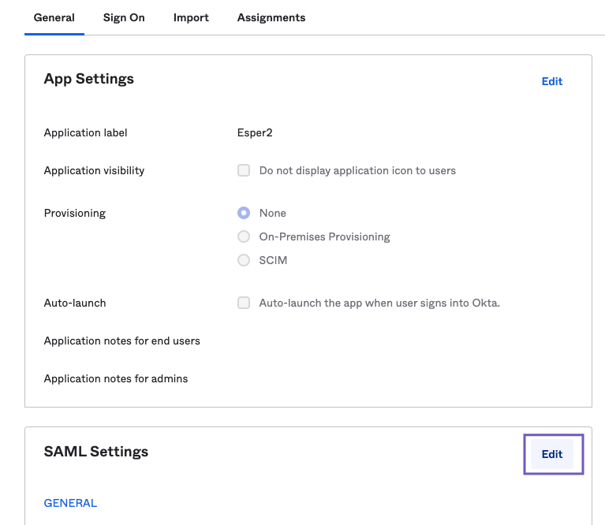

Under the Configure SAML tab, making the following changes: 
- Replace the Sign on URL with Esper’s ACS URL. 
- Enable “Use this for Recipient URL and Destination URL.” 
- In “Audience URI (SP Entity ID)”, replace the temporary name with Esper’s Entity ID. 
- In “Name ID format”, select ‘EmailAddress’ from the drop-down menu. 

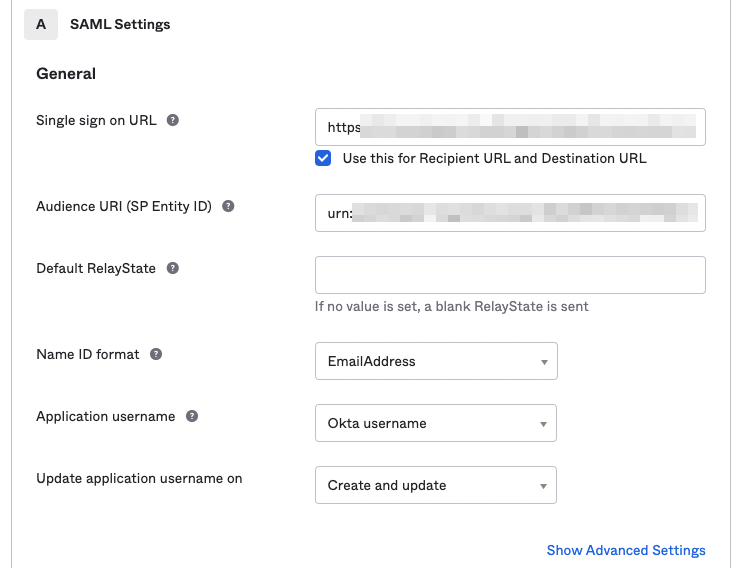

### Providing the Logout Certificate to Okta (optional)

::: details

Select “Show Advanced Settings.”

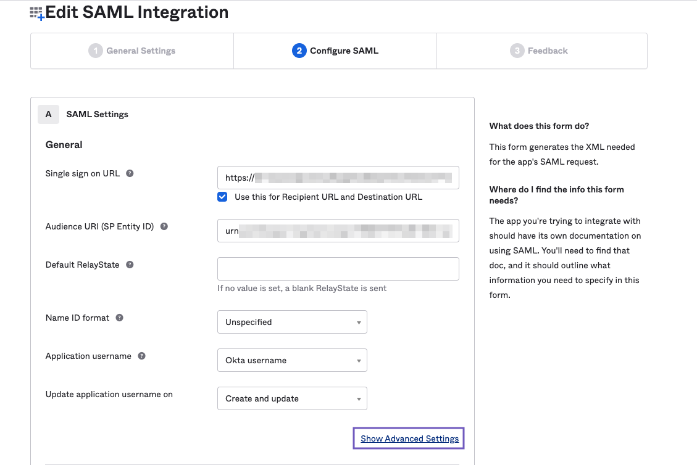

In “Signature Certificate,” upload the certificate from Esper (it should be a pem file). Enable “Allow application to initiate Single Logout.” 

Then input Esper’s “Logout URL.” 

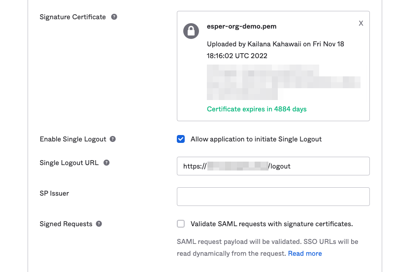

:::

Then, press **Next** and **Finish**. 

In Esper:

Check that you have copied the service provider information to your SSO provider and press **Confirm**. 

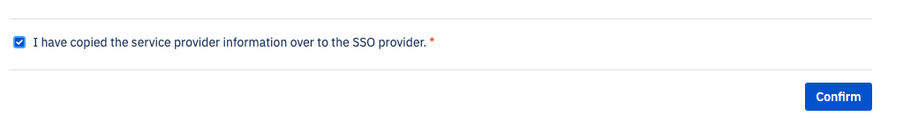

Once SSO is configured, select an authentication option: 
- Sign in with either method (email/password or Google authentication) 
- Restrict access to only SSO. 

::: warning
We recommend testing that your SSO is working as expected before selecting “users must sign in with SSO.”  At least one administrator should have accepted the SSO invite and have the credentials to log in before marking this option. Other login methods will be disabled.
:::

We recommend testing that your SSO is working as expected *before* selecting ‘users must sign in with SSO’. See Step 4 Granting Access to Users.

Before users can log in, you’ll need to add users through Okta and Esper. 

**Step 4 Granting Access to Users**

Once you’ve set up SSO configurations, you’ll need to add users in Okta and Esper.

In Okta, go to the Esper app page. Go to the “Assignments” tab. Select “Assign” and select “Assign to People” or “Assign to Groups.” 

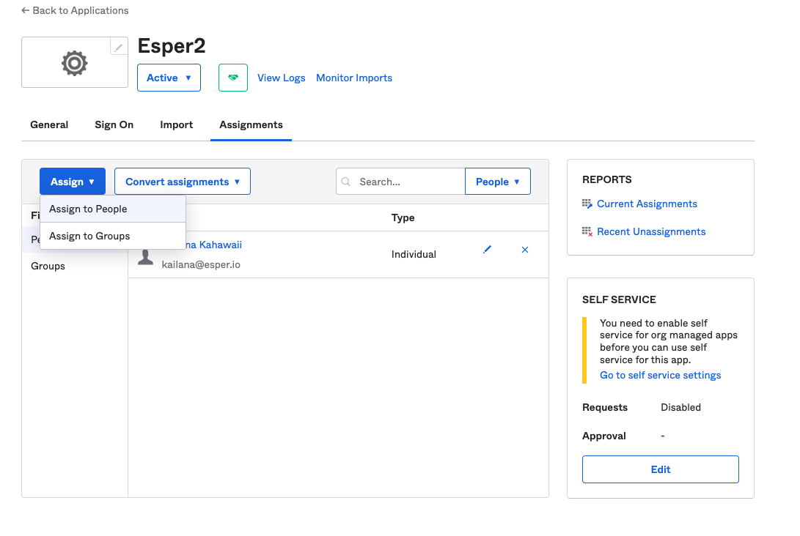

Assign the users by clicking “Assign” next to their email addresses/User Name or the group name. Provision their username (often their email address) and click “Save and Go Back.” Users will need to log in to Esper using the same email addresses listed in Okta. 

You will now need to grant users access in Esper. 

In Esper, go to your profile and select User Management. Add a new user by pressing **New User.** Enter their information and press **Continue,**  then select their access privileges. The user will receive an email to sign up to the Esper tenant.

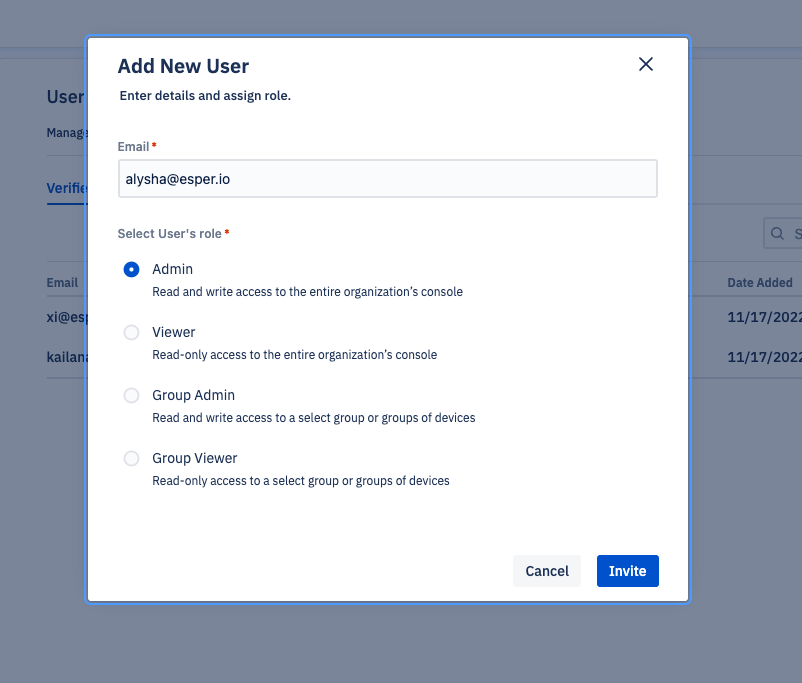

Users who are invited but have not yet accepted the invitation will appear in the Pending tab. 

## How to Accept the SSO Invite 

Invited users will receive an invitation in their inbox. Once they click on the invitation link, they should choose the SSO login method (see Step 3). Choosing another login method (such as password or Google) will not satisfy the SSO criteria. 

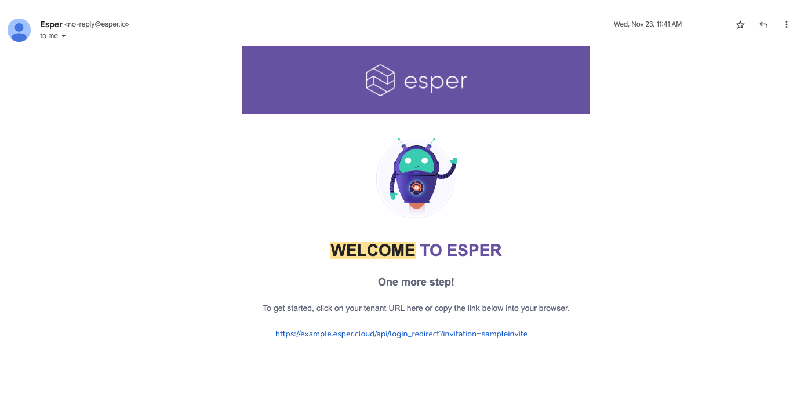

