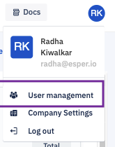
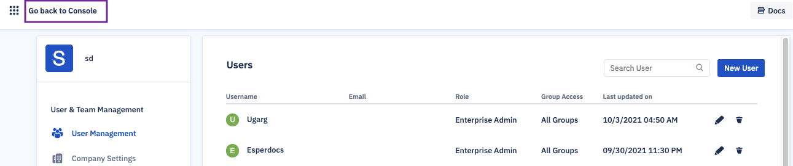

## What is User Management?

  

To access Esper’s user management functions, click on the user profile icon at the top-right of the screen, then select User Management from the dropdown menu.

  

  
  

On the ‘User Management’ page, you can see all the users in your console. You can add more users , delete users or change the authorisation and control of the users from this section.

  

**Note**: Only Enterprise Admin roles can access this page. Users with other roles will not see the User management option in the dropdown.

  

You could go back to the console by selecting the ‘Go back to Console’ link on the top left corner.