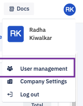

## How to Delete a User?

Click on your profile icon at the top right corner of the console. Choose ‘User Management’ from the drop-down.

  

  

To delete a user from the enterprise, click on the trash can icon in line with that user’s listing. That user will no longer be able to access their account.

  

