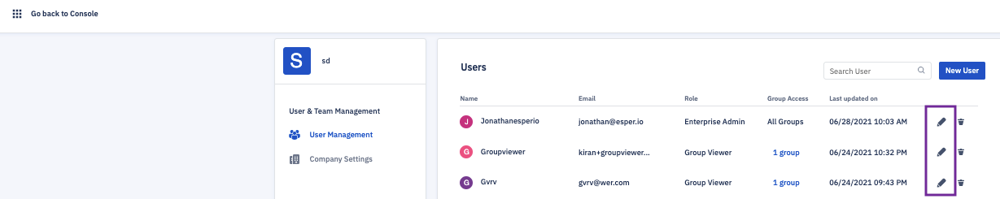

## How to Edit User authorizations?

Click on your profile icon at the top right corner of the console. Choose ‘User Management’ from the drop-down.

  

  
  

The User Management screen also enables you to edit the details of a user. To do so, click on the pencil icon in line with that user’s listing.

  

You will be able to change the username, email, full name, password, and role assigned to the user. If you modify a user's details, be sure to pass the changes on to the account owner so they can continue to access the Esper console.