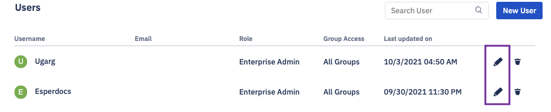

## How to Edit User Authorizations?

Click the profile icon at the top right corner of the Console. Choose ‘User Management’ from the drop-down.

  

  
  

Click the pencil icon in line with that user’s listing.

  

You will be able to edit the username, email, full name, password, and role assigned to the user. 