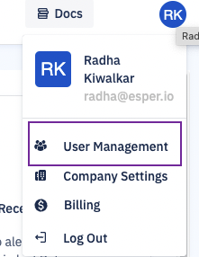
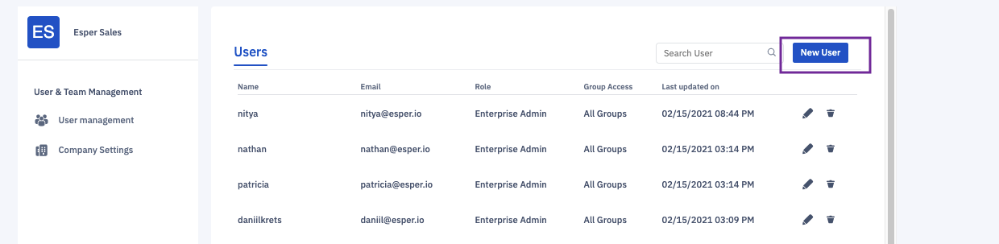
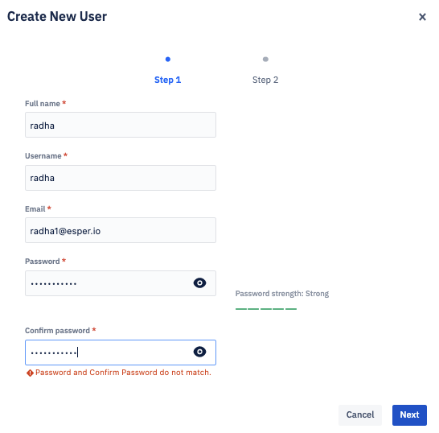
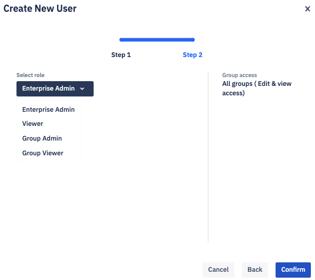
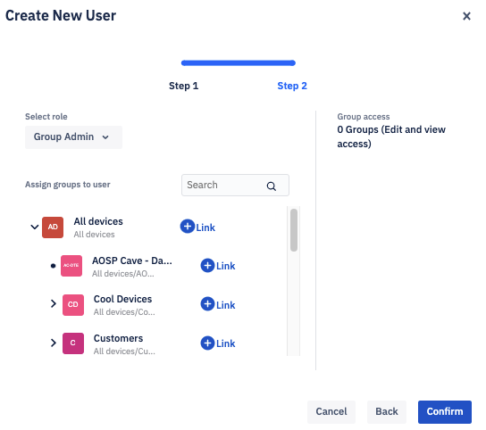

## How to Add a New User?

Step 1: Click on your profile icon at the top right corner of the console. Choose ‘User Management’ from the drop-down.

  

  
  

Step 2: Click on **New User**.

  

  

Step 3: Enter the new user’s name, username, email, and password. Re-enter the password and click **Next**.

  

Step 4: Select the new user’s role from the dropdown menu.

  

Step 5: If you’re creating a Group Admin or Group Viewer, assign to the appropriate groups and click **Confirm**.

  

**Note**: After adding a user, be sure to provide the user with their login credentials so that they can successfully log in.