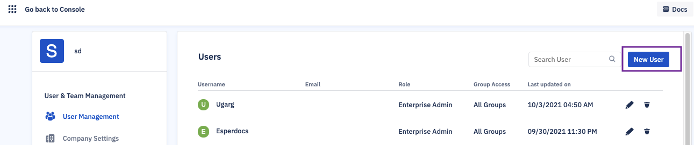
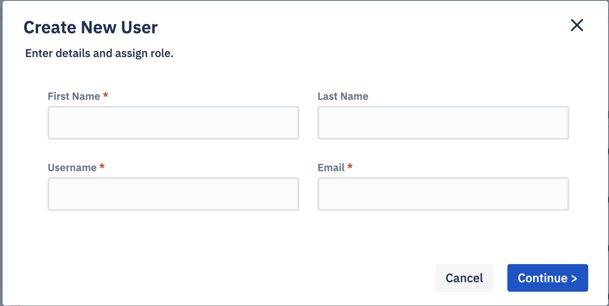

## How to Add a New User?

Step 1: Click the profile icon at the top right corner of the Console. Choose ‘User Management’ from the drop-down.

  

  
  

Step 2: Click **New User**.

  

  

Step 3: Enter the new user’s first name, last name, username, and email address. Click **Continue**.

  

Step 4: Select the new user’s role from the dropdown menu.

  

Step 5: If you’re creating a Group Admin or Group Viewer, assign an appropriate groups and click **Confirm**.

  

