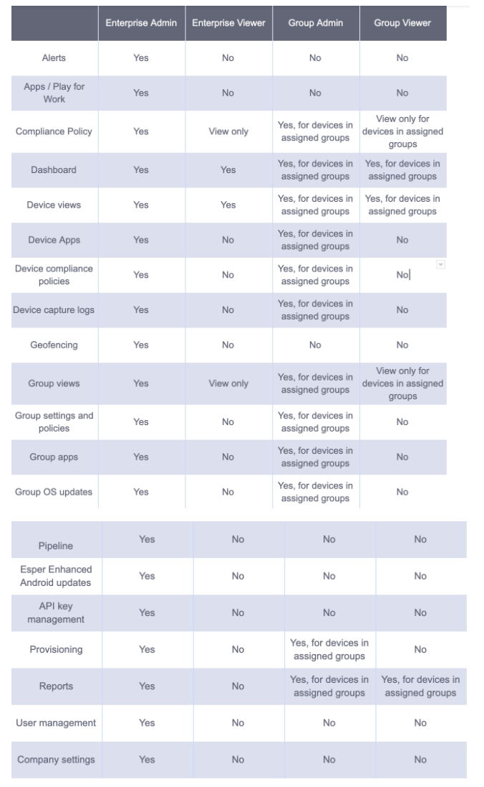

## What are the Different Types of User Roles and Access Controls?

There are four user roles for the Esper Console: Enterprise Administrator, Enterprise Viewer, Group Administrator, and Group Viewer. When setting up a group, be mindful that each role has different permissions. Enterprise Administrators have the highest level of permissions and can view or change most of the settings. In contrast, a Group Viewer has far fewer permissions. These users need permissions to view tasks for the devices and groups. The privileges and permissions for each role are as follows:

